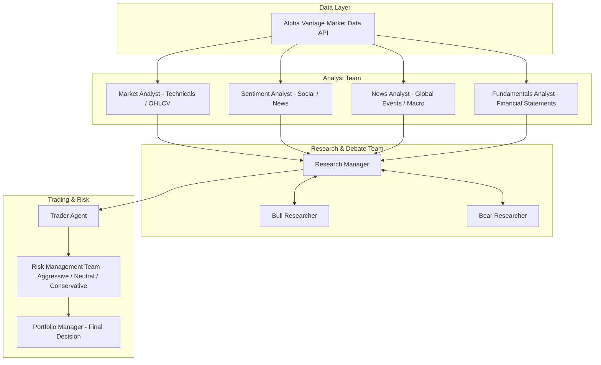

# Agent Trader

[](https://www.python.org/downloads/)
[](https://github.com/langchain-ai/langgraph)
[](https://www.alphavantage.co/)

**Agent Trader** is a clean, modular multi-agent autonomous financial research and trading framework powered by Large Language Models and orchestrated with LangGraph.

By simulating the organizational structure of a quantitative hedge fund, Agent Trader coordinates specialized LLM agents (fundamental analysts, sentiment analysts, technical analysts, news researchers, bull/bear debaters, traders, and risk managers) to perform institutional-grade financial analysis and generate structured trading signals.

---

## Multi-Agent Architecture



### Agent Roles & Workflow

1. **Analyst Team**:
   - **Market Analyst**: Computes technical indicators (RSI, MACD, Moving Averages) and analyzes price action trends.
   - **Fundamentals Analyst**: Evaluates balance sheets, income statements, cash flow statements, and valuation ratios.
   - **News Analyst**: Ingests market headlines and assesses macro implications.
   - **Sentiment Analyst**: Quantifies short-term market psychology and sentiment polarity.
2. **Research & Debate Team**:
   - **Bullish & Bearish Researchers**: Engage in structured adversarial debate to stress-test hypotheses and challenge assumptions.
   - **Research Manager**: Moderates the debate, synthesizes consensus, and formulates a consolidated investment thesis.
3. **Execution & Risk Management**:
   - **Trader**: Determines trade direction, entry/exit levels, and position sizing.
   - **Risk Management Team**: Three distinct risk personas (Aggressive, Neutral, Conservative) audit the proposal against market volatility and drawdowns.
   - **Portfolio Manager**: Renders the final binding trade decision.

---

## Supported LLM Providers

Agent Trader is streamlined to support top-tier cloud and local LLM backends:

| Provider | Description | Default Models |
| :--- | :--- | :--- |
|  **Google Gemini** | Flagship reasoning & fast multimodality with thinking controls | `gemini-3.5-flash`, `gemini-3.1-flash-lite`, `gemini-2.5-pro` |
|  **Groq** | Ultra-low latency LPU inference | `llama-3.3-70b-versatile`, `llama-3.1-8b-instant` |
|  **OpenRouter** | Unified gateway to all open & commercial models | `anthropic/claude-3.5-sonnet`, `deepseek/deepseek-r1`, `openai/gpt-4o` |
|  **NVIDIA NIM** | High-performance enterprise AI microservices | `meta/llama-3.3-70b-instruct`, `nvidia/llama-3.1-nemotron-70b-instruct` |
|  **Ollama** | 100% offline & local models (with live local model auto-discovery) | `llama3.3`, `llama3.2`, `qwen2.5-coder`, `deepseek-r1` |

---

## Market Data Pipeline

Agent Trader automatically routes equities, technical indicators, corporate fundamentals, and news sentiment queries to **Alpha Vantage**:
- **Daily / Intraday Price Bars (OHLCV)**
- **Technical Indicators** (SMA, EMA, RSI, MACD, Bollinger Bands, ATR)
- **Financial Statements** (Balance Sheet, Cash Flow, Income Statement, Earnings)
- **News Sentiment & Topics Feed**

---

## Quick Start

### 1. Clone & Setup Environment

```bash
git clone https://github.com/Lohith848/agent-trader.git
cd agent-trader

# Create and activate virtual environment
python -m venv .venv

# On Windows:
.venv\Scripts\activate

# On macOS/Linux:
source .venv/bin/activate

# Install dependencies
pip install -e .
```

### 2. Configure Environment Variables

Create a `.env` file in the project root:

```bash
cp .env.example .env
```

Edit `.env` with your API keys:

```env
# Primary Market Data Provider (Required)
ALPHA_VANTAGE_API_KEY=your_alpha_vantage_api_key_here

# Choose one or more LLM providers:
GEMINI_API_KEY=your_google_api_key_here
GROQ_API_KEY=your_groq_api_key_here
OPENROUTER_API_KEY=your_openrouter_api_key_here
NVIDIA_API_KEY=your_nvidia_api_key_here

# Local Ollama endpoint (optional, defaults to http://localhost:11434/v1)
OLLAMA_BASE_URL=http://localhost:11434/v1
```

### 3. Run the Interactive CLI

Launch the interactive terminal interface:

```bash
python -m cli.main
```

Follow the guided prompts:
1. **Ticker Symbol**: e.g., `AAPL`, `NVDA`, `TSLA`, `SPY`
2. **Analysis Date**: Backtest or run on current date (`YYYY-MM-DD`)
3. **Select Analysts**: Market, Fundamentals, News, Sentiment
4. **Debate Depth**: Configure rounds of adversarial debate
5. **LLM Provider**: Pick from Google, Groq, OpenRouter, NVIDIA, or Ollama
6. **Model Selection**: Choose your quick-thinking and deep-thinking agents

---

## Python Library Usage

You can also run Agent Trader programmatically inside your custom pipelines:

```python
from tradingagents.default_config import DEFAULT_CONFIG
from tradingagents.graph.trading_graph import TradingAgentsGraph

# Configure your trading run
config = {
    **DEFAULT_CONFIG,
    "llm_provider": "google",
    "deep_think_llm": "gemini-3.5-flash",
    "quick_think_llm": "gemini-3.1-flash-lite",
    "max_debate_rounds": 1,
    "max_risk_discuss_rounds": 1,
}

# Initialize graph
graph = TradingAgentsGraph(
    selected_analysts=["market", "fundamentals", "news", "social"],
    config=config,
)

# Execute trade analysis
state = graph.run(
    ticker="NVDA",
    trade_date="2026-03-01",
)

# Access final decision and reports
print("Trader Plan:", state.get("trader_investment_plan"))
print("Final Decision:", state.get("final_trade_decision"))
```

---

## 🛠️ Configuration Reference

You can customize runtime behavior using environment variables or configuration dictionaries:

| Environment Variable | Description | Default |
| :--- | :--- | :--- |
| `TRADINGAGENTS_LLM_PROVIDER` | LLM provider (`google`, `groq`, `openrouter`, `nvidia`, `ollama`) | `google` |
| `TRADINGAGENTS_DEEP_THINK_LLM` | Model used for complex reasoning & synthesis | `gemini-3.5-flash` |
| `TRADINGAGENTS_QUICK_THINK_LLM` | Model used for fast individual analyst evaluations | `gemini-3.1-flash-lite` |
| `TRADINGAGENTS_GOOGLE_THINKING_LEVEL` | Gemini reasoning effort (`minimal`, `low`, `medium`, `high`) | `None` |
| `TRADINGAGENTS_MAX_DEBATE_ROUNDS` | Adversarial debate iterations between Bull & Bear researchers | `1` |
| `TRADINGAGENTS_MAX_RISK_ROUNDS` | Risk management discussion iterations | `1` |
| `TRADINGAGENTS_TEMPERATURE` | Model temperature / randomness | `None` (provider default) |
| `TRADINGAGENTS_LLM_MAX_RETRIES` | Max retries for transient 429 / network errors | `None` (SDK default) |
| `TRADINGAGENTS_CHECKPOINT_ENABLED` | Save LangGraph checkpoint state per node | `False` |

---

## Testing

The repository includes a comprehensive test suite covering dataflows, prompt routing, model validation, and graph execution:

```bash
# Run the complete test suite
pytest
```

---

>  **Disclaimer**: Agent Trader is built for research and educational purposes only. It is not financial or investment advice. Always perform your own due diligence before executing real trades.
